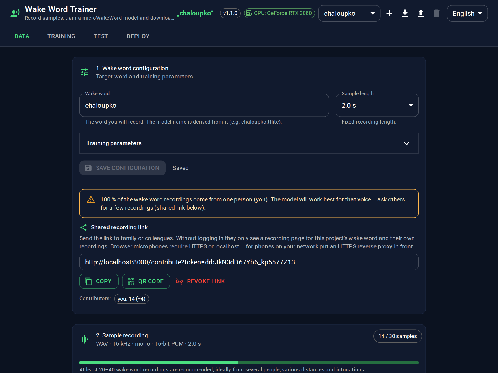
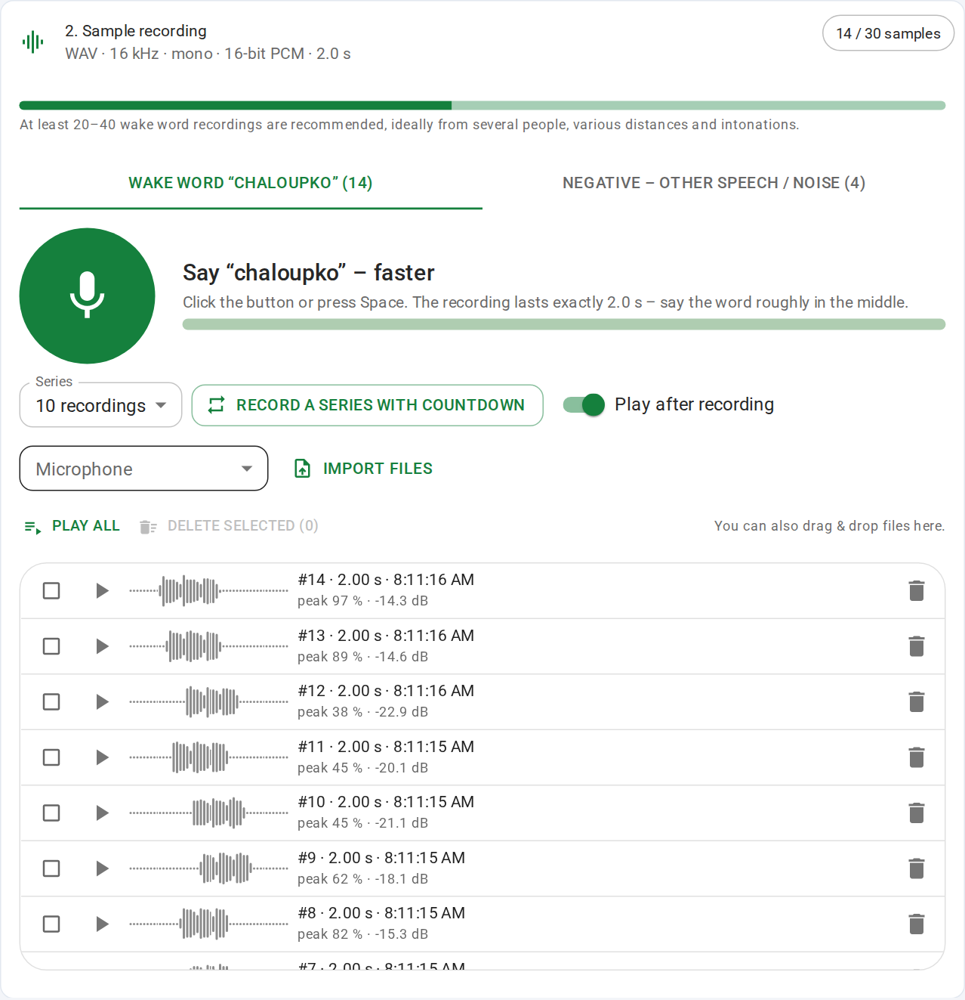
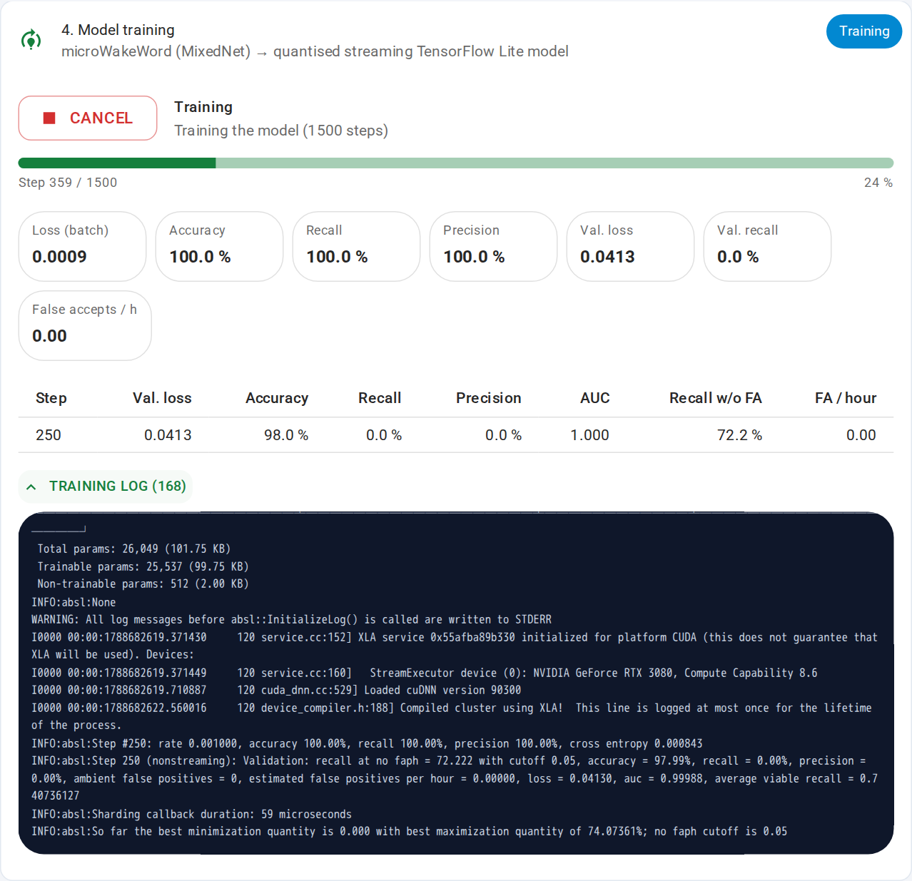
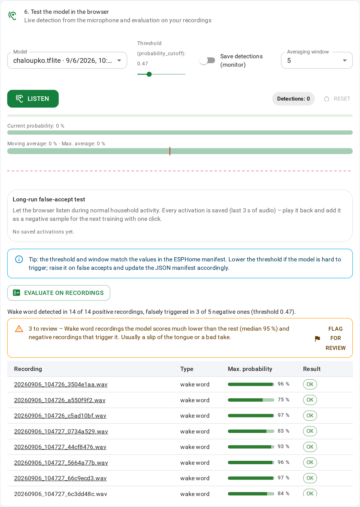
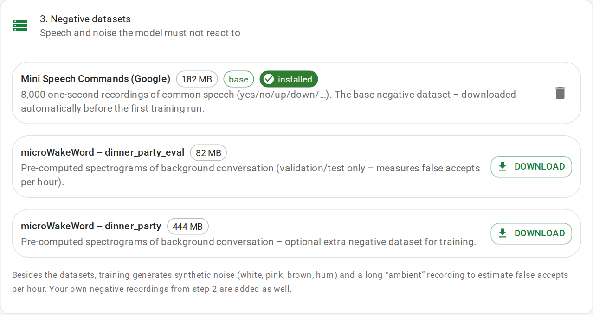
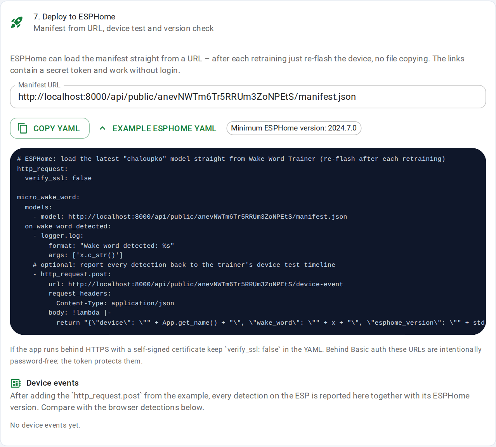
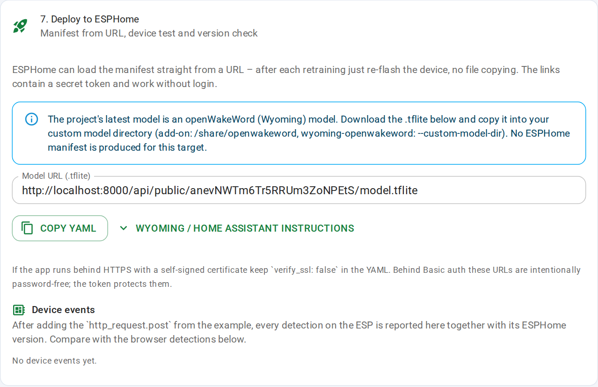

# Wake Word Trainer


A self-contained web app for recording voice samples, training your own **wake word** model and testing the result
live in the browser. Two targets:

- **ESPHome** – [microWakeWord](https://github.com/kahrendt/microWakeWord) (TensorFlow → quantised streaming TensorFlow
  Lite) running directly on an ESP32-S3 via the [`micro_wake_word`](https://esphome.io/components/micro_wake_word) component.
- **Wyoming** – an [openWakeWord](https://github.com/dscripka/openWakeWord)-compatible model (Google speech embeddings +
  small DNN, trained here in TensorFlow) for `wyoming-openwakeword` and the Home Assistant openWakeWord add-on.



## Features

- **Sample recording in the browser** – Web Audio API (AudioWorklet), fixed-length clips, WAV 16 kHz / mono / 16-bit PCM.
  Series recording with countdown, playback after recording, play-all, microphone selection, quality checks
  (clipped start/end, clipping, too quiet, silence), mini waveforms, bulk delete with undo, drag & drop import,
  keyboard shortcuts (Space / R / Esc).
- **Negative data handled for you** – Google *mini_speech_commands* is downloaded automatically; synthetic noise and a long
  "ambient" recording for false-accept-per-hour estimation are generated; optional microWakeWord `dinner_party` sets.
- **Training pipeline** – silence trimming + augmentation (audiomentations) → micro-frontend spectrograms → MixedNet training with the
  original `microwakeword.model_train_eval` → int8 quantised streaming `.tflite`. Live progress over SSE: steps, loss,
  accuracy, validation table, log.
- **Wyoming / openWakeWord target** – the same recordings and negatives go through openWakeWord's official
  melspectrogram + speech-embedding models (downloaded once, run with the TFLite runtime) into a Keras re-implementation
  of the openWakeWord DNN classifier; the exported float32 `.tflite` has the `(1, 16, 96)` input wyoming-openwakeword
  expects. The live test, evaluation and monitor use the same streaming feature pipeline as the satellite. Optional:
  openWakeWord's 10-hour validation feature set for false-accept estimation.
- **Live test** – microphone audio is streamed over WebSocket to the server, which runs the very same quantised streaming
  model with the same micro-frontend and sliding-window average as ESPHome. Evaluate the model on all stored recordings
  to see which samples are missed and which negatives trigger it; outliers (bad takes, negatives that trigger) can be
  flagged for review with one click.
- **Long-run false-accept monitor** – leave the browser listening during normal household activity; every activation is
  saved (last 3 s of audio), can be played back and turned into a negative sample – or adopt them all and retrain with one click.
- **Contributor balance** – a warning when one voice dominates the wake word recordings (the model would overfit to it).
- **Deploy to ESPHome** – the latest model and manifest are served from token-protected URLs, so ESPHome can load
  `model: https://…/manifest.json` directly; an example YAML also posts every on-device detection back to the trainer's
  device timeline (with the ESPHome version, warning when it is older than the manifest requires). A bundle ZIP packs the
  latest model of every project with one YAML for several wake words on one device.
- **Queue and sweeps** – start runs while another is training (they queue up), or schedule a parameter sweep
  (e.g. steps 2000/4000/8000) and compare the results in the morning; the history shows what changed between runs.
- **ESPHome manifest** – `probability_cutoff` is derived from the test-set ROC curve; tune it in the test card and copy it over.
- **Multiple projects** – each wake word lives in its own project (recordings, runs, settings); switch in the header,
  export/import a whole project as a ZIP for backups or moving between machines.
- **Shared recording link** – generate a link (`/contribute?token=…`) so family or colleagues can record samples for a
  project from their own device without logging in; they only see their own recordings.
- **Recording modes** – tag samples as *far away*, *with background noise*, *whisper* or *loud*; the evaluation shows per-mode
  results so you see where the model fails. Contributors get a per-person target and a QR code for the link.
- **Real rooms and noise** – MIT room impulse responses (auto-downloaded) reverberate your samples during augmentation;
  optional ESC-50 environmental sounds and FMA music serve as real background and extra negatives.
- **Hard negatives** – word fragments and swapped halves of your recordings are used as extra negatives so similar words
  do not trigger the model (optional).
- **Automatic threshold and window** – after training the model is run over your own recordings with sliding windows of
  3/5/7 frames; the window with the best separation is chosen and `probability_cutoff` is set so that ~95 % of the wake word
  samples pass while every negative recording stays below.
- **Charts and comparison** – validation loss and recall/accuracy over steps, test-set ROC curve; pick two runs to compare
  parameters, metrics and per-recording results side by side.
- **Notifications** – browser notification when a run finishes, plus an optional webhook (e.g. Home Assistant) with a JSON summary.
- **GPU indicator and version** – the header shows whether a GPU is visible to the container and whether the TensorFlow build
  can use it, plus the app version with a hint when a newer tag exists on GitHub.
- **Tabbed UI** – Data (configuration, recording, datasets) · Training (runs, history) · Test · Deploy; the active tab is kept in the URL hash.
- **Robust runs** – an interrupted run (container restart) is detected and can be resumed from its checkpoint; old runs
  are pruned automatically (`KEEP_JOBS`), heavy intermediate files are removed after a successful run.
- **Export** – ZIP bundle with the `.tflite`, the ESPHome manifest, an example ESPHome YAML and the training log.
- **UI** – React + Material UI, light/dark theme following the system, Czech/English following the browser language (manual override in the header).
- **Docker** – one command to run, optional NVIDIA GPU build (works in WSL2), runs as an unprivileged user (`PUID`/`PGID`),
  optional HTTP Basic auth. CI runs unit tests, the frontend build and a Playwright smoke test of the Docker image.

| Recording | Training |
| --- | --- |
|  |  |

| Live test & evaluation | Datasets |
| --- | --- |
|  |  |

| Deploy to ESPHome | Deploy to Wyoming |
| --- | --- |
|  |  |

## Quick start

```bash
# CPU (works everywhere)
docker compose up --build

# NVIDIA GPU (Docker + nvidia-container-toolkit; works in WSL2)
docker compose -f docker-compose.yml -f docker-compose.gpu.yml up --build
# …or: cp .env.example .env   (sets COMPOSE_FILE to include the GPU override) and just `docker compose up --build`
```

Open <http://localhost:8000>. Everything (recordings, datasets, feature cache, models) lives in `./data`, owned by
`PUID`/`PGID` (default 1000:1000 – set them in `.env` to your `id -u` / `id -g`).

> The microphone only works in a secure context – `localhost` or HTTPS. From another machine use an SSH tunnel
> (`ssh -L 8000:localhost:8000 host`) or an HTTPS reverse proxy.

**GPU is optional.** The model is tiny (~30 k parameters); the default 4,000 steps take minutes on a CPU. The first run
additionally pre-computes spectrograms of the negative dataset once (~1–2 min, cached in `data/features_cache`).

Optional Basic auth: set `APP_USER` / `APP_PASSWORD` (see `.env.example`). `PUBLIC_URL` is used in webhook payloads,
`WEBHOOK_URL` is a global fallback for the per-project webhook.

### Coolify / Proxmox LXC with a GPU

`docker-compose.coolify.yml` is a single-file compose for Coolify's *Docker Compose* build pack with NVIDIA GPU reservation.
For a Coolify instance inside a Proxmox LXC you need, in this order:

1. NVIDIA driver on the Proxmox host (`nvidia-smi` works there).
2. GPU devices passed into the LXC: in `/etc/pve/lxc/<id>.conf` add `lxc.cgroup2.devices.allow: c 195:* rwm`,
   `c 509:* rwm` (check `ls -l /dev/nvidia*` for the major numbers) and `lxc.mount.entry` lines for `/dev/nvidia0`,
   `/dev/nvidiactl`, `/dev/nvidia-uvm`, `/dev/nvidia-uvm-tools`, `/dev/nvidia-modeset`.
3. Inside the LXC the **same driver version** installed with `--no-kernel-module`, then `nvidia-container-toolkit` and
   `nvidia-ctk runtime configure --runtime=docker` for the Docker that Coolify uses. `docker run --rm --gpus all nvidia/cuda:12.5.0-base-ubuntu22.04 nvidia-smi` must work.
4. In Coolify create a *Docker Compose* resource from this repository pointing at `docker-compose.coolify.yml`, set a domain
   with HTTPS (needed for the microphone) and add `APP_PASSWORD`. The header chip shows *GPU: …* when everything is wired up;
   without the GPU the same image still trains on the CPU.

## Workflow

1. **Configure** – wake word (e.g. `chaloupko`), sample length, optionally training parameters (steps, learning rate, batch
   size, augmentations per sample, model window, negative class weight).
2. **Record** – 20–40 samples recommended, ideally several speakers, distances and intonations. Optionally record negative
   samples (other speech, similar words, room noise).
3. **Datasets** – the base negative dataset downloads automatically before the first run; extra sets are optional.
4. **Train** – watch the progress live; the best weights (by *average viable recall*) are converted and quantised.
5. **Download** – `<wakeword>.tflite` and `<wakeword>.json` (ESPHome manifest).
6. **Test** – listen live, tune threshold/window, evaluate on your recordings.

Need more voices? Open **Shared recording link** in the configuration card and send the link around. Contributors
need HTTPS (or localhost) for the microphone – put an HTTPS reverse proxy (e.g. Caddy) in front when sharing on a LAN.

### Using the model in ESPHome

```yaml
micro_wake_word:
  models:
    - model: chaloupko.json   # manifest next to chaloupko.tflite in the ESPHome config folder
```

Lower `probability_cutoff` if the word is hard to trigger; raise it on false activations.

## API

| Method | Path | Description |
| --- | --- | --- |
| GET / PUT | `/api/config` | Current project configuration (wake word, training parameters) |
| GET / POST / DELETE | `/api/projects` · `/api/projects/{id}/select` · `/api/projects/{id}/share` | Projects and sharing links |
| GET / POST | `/api/contribute/info` · `/api/contribute/recordings` (`?token=…&name=…`) | Contributor (record-only) access |
| GET | `/api/recordings?kind=positive\|negative` · `/api/recordings/contributors` | Recordings incl. waveform peaks, quality analysis, tags; per-contributor counts |
| PUT | `/api/recordings/{kind}/{id}/tag` | Set the recording mode tag |
| GET | `/api/system` | GPU / TensorFlow CUDA / CPU info, device used by the last training |
| GET / POST | `/api/projects/{id}/export` · `/api/projects/import` | Project ZIP export / import |
| POST | `/api/recordings` | Upload (multipart `file`, `kind`) → `/data/positive_samples` or `/data/negative_samples` |
| GET | `/api/recordings/{kind}/{id}` | Play a WAV |
| DELETE | `/api/recordings/{kind}/{id}` | Soft delete (trash), `POST …/restore` restores |
| GET / POST | `/api/datasets` · `/api/datasets/{id}/download` | Negative datasets |
| POST / GET | `/api/train` · `/api/train/resume` · `/api/train/cancel` · `/api/train` | Start (optionally `{training: {...overrides}, label}` – queued while running) / resume / cancel / snapshot |
| POST / GET / DELETE | `/api/train/sweep` · `/api/train/queue` · `/api/train/queue/{id}` | Parameter sweep, queue |
| GET / POST / DELETE | `/api/monitor` · `/api/monitor/{id}/negative` · `/api/monitor/{id}` · `/api/monitor/device-events` | Saved activations from the long-run test, ESP device events |
| GET | `/api/projects/{id}/public-urls` · `/api/public/{token}/manifest.json` · `/api/public/{token}/model.tflite` | Token-protected model URLs for ESPHome (no login) |
| POST | `/api/public/{token}/device-event` | Detection reported by an ESPHome device |
| GET | `/api/bundle?projects=a,b` | ZIP with the latest models of several projects + ESPHome YAML |
| GET | `/api/train/status` | SSE stream (`snapshot`, `state`, `log`) |
| GET | `/api/train/model` | Latest trained `.tflite` |
| GET | `/api/jobs` · `/api/jobs/{id}/model` · `/api/jobs/{id}/manifest` · `/api/jobs/{id}/export` · `/api/jobs/{id}/log` | Run history, ZIP export |
| WS | `/api/test/ws?job_id=…&cutoff=…&window=…&save=1` | Live test: binary int16 16 kHz PCM in → JSON probabilities/detections out (`save=1` stores each activation) |
| POST | `/api/jobs/{id}/evaluate?cutoff=…&window=…` | Evaluate a model on the stored recordings |

## Project layout

```
backend/app        FastAPI (config, recordings, datasets, training + SSE, live test, static frontend)
backend/trainer    Training pipeline (run.py) and audio helpers
backend/tests      pytest suite (no TensorFlow needed: `pip install -r backend/requirements-dev.txt && cd backend && pytest`)
frontend           Vite + React + TypeScript + Material UI
tests/e2e          Playwright smoke test used in CI against the Docker image
docs/screenshots   README images
data/              (created at runtime) negative_datasets/, features_cache/, projects/<id>/{positive_samples,negative_samples,jobs}
```

## Development without Docker

```bash
cd backend && pip install -r requirements.txt tensorflow==2.19.0
git clone https://github.com/kahrendt/microWakeWord /opt/microWakeWord && pip install --no-deps -e /opt/microWakeWord
DATA_DIR=../data uvicorn app.main:app --reload
# frontend (proxies /api to :8000)
cd frontend && npm install && npm run dev
```

### Using a Wyoming model

Pick *Wyoming* as the target platform in the configuration card and train. Then copy `<wakeword>.tflite` into your
custom model directory – `/share/openwakeword/` for the Home Assistant add-on, or `--custom-model-dir` for
`wyoming-openwakeword` – and select the model name in the Assist pipeline. The Deploy tab shows a ready-made
docker-compose snippet and a direct download URL for the latest model. Only the classifier is trained here; openWakeWord's
own feature models (`melspectrogram.tflite`, `embedding_model.tflite`) are fetched from its GitHub release.

## Not supported (yet)

- **TTS sample generation (Piper)** – planned as an optional Docker profile.
- **openWakeWord ONNX export** – only `.tflite` is produced (that is what wyoming-openwakeword and the add-on use).

## Credits

Built on [microWakeWord](https://github.com/kahrendt/microWakeWord) by Kevin Ahrendt (Apache 2.0). Negative speech data:
Google Speech Commands (CC BY 4.0). Trained models inherit the licences of the data used.
